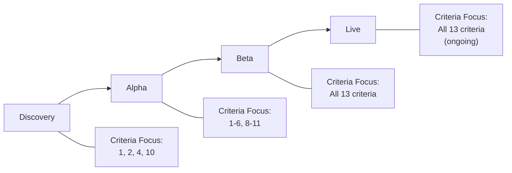

# DTA Digital Service Standard Review

> **Template Status**: Beta | **Version**: [VERSION] | **Command**: `/arckit.tcop`

## Document Control

| Field | Value |
|-------|-------|
| **Document ID** | ARC-[PROJECT_ID]-TCOP-v[VERSION] |
| **Document Type** | DTA Digital Service Standard Review |
| **Project** | [PROJECT_NAME] (Project [PROJECT_ID]) |
| **Classification** | [PUBLIC / OFFICIAL / OFFICIAL: Sensitive / PROTECTED / SECRET] |
| **Status** | [DRAFT / IN_REVIEW / APPROVED / PUBLISHED / SUPERSEDED / ARCHIVED] |
| **Version** | [VERSION] |
| **Created Date** | [YYYY-MM-DD] |
| **Last Modified** | [YYYY-MM-DD] |
| **Review Cycle** | [Monthly / Quarterly / Annual / On-Demand] |
| **Next Review Date** | [YYYY-MM-DD] |
| **Owner** | [OWNER_NAME_AND_ROLE] |
| **Reviewed By** | [REVIEWER_NAME] on [DATE] or [PENDING] |
| **Approved By** | [APPROVER_NAME] on [DATE] or [PENDING] |
| **Distribution** | [DISTRIBUTION_LIST] |

## Revision History

| Version | Date | Author | Changes | Approved By | Approval Date |
|---------|------|--------|---------|-------------|---------------|
| [VERSION] | [DATE] | ArcKit AI | Initial creation from `/arckit.[COMMAND]` command | [PENDING] | [PENDING] |

## Document Purpose

This document assesses the project's compliance with the Australian Government's **Digital Service Standard** (DTA), which defines 13 criteria that Australian Government digital services must meet to ensure they are simple, clear, and fast. Compliance is mandatory for all new and redesigned government services that have a digital component.

**Applicable Frameworks**:
- DTA Digital Service Standard (13 criteria)
- Australian Privacy Principles (APPs) under Privacy Act 1988
- Information Security Manual (ISM) from ASD
- Protective Security Policy Framework (PSPF)
- ASD Essential Eight Maturity Model
- Hosting Certification Framework (HCF)

---

## Executive Summary

**Overall DTA Digital Service Standard Compliance**: [Compliant / Partially Compliant / Non-Compliant]

**Assessment Stage**: [Discovery / Alpha / Beta / Live]

**Key Findings**:
- [Summary of major compliance gaps]
- [Summary of strengths]
- [Critical actions required]

---

## Criterion 1: Understand What Users Need

**Guidance**: Research to develop a deep knowledge of the users and their context for using the service. Understand user needs through research, testing, and by putting people at the centre of design.

**Reference**: https://www.dta.gov.au/help-and-advice/about-digital-service-standard/digital-service-standard-criteria/1-understand-what-users-need

### Assessment

**Status**: [Compliant | Partially Compliant | Non-Compliant | N/A Not Applicable]

**Evidence**:
[Describe how user needs have been identified and documented]

**User Research Activities**:
- [ ] Discovery research conducted with real users
- [ ] User personas created based on research data
- [ ] User journey mapping completed
- [ ] Pain points and user needs documented and prioritised
- [ ] Assisted digital needs identified (users who need help using digital services)
- [ ] Ongoing user research plan in place for alpha/beta/live stages
- [ ] Research findings shared across the team
- [ ] User stories derived from research

**Gaps/Actions Required**:
- [Action 1]
- [Action 2]

---

## Criterion 2: Have a Multidisciplinary Team

**Guidance**: Establish a sustainable multidisciplinary team to design, build, operate, and iterate the service, led by an experienced product/service manager with decision-making responsibility.

**Reference**: https://www.dta.gov.au/help-and-advice/about-digital-service-standard/digital-service-standard-criteria/2-have-multidisciplinary-team

### Assessment

**Status**: [Compliant | Partially Compliant | Non-Compliant | N/A Not Applicable]

**Evidence**:
[Describe team structure and capabilities]

**Team Composition**:
- [ ] Product/service manager identified with decision-making authority
- [ ] Multidisciplinary team established (design, development, research, content, operations)
- [ ] User researcher embedded in team
- [ ] Technical lead/architect assigned
- [ ] Content designer assigned
- [ ] Interaction/service designer assigned
- [ ] Team has appropriate authority to make day-to-day decisions
- [ ] Team is co-located or has effective remote collaboration in place
- [ ] Arrangements for ongoing team sustainability beyond initial delivery

**Key Team Members**:

| Role | Name | Organisation | Engagement Type |
|------|------|-------------|-----------------|
| Product/Service Manager | [Name] | [Org] | [FTE / Contractor / Shared] |
| User Researcher | [Name] | [Org] | [FTE / Contractor / Shared] |
| Designer | [Name] | [Org] | [FTE / Contractor / Shared] |
| Developer | [Name] | [Org] | [FTE / Contractor / Shared] |
| Content Designer | [Name] | [Org] | [FTE / Contractor / Shared] |

**Gaps/Actions Required**:
- [Action 1]
- [Action 2]

---

## Criterion 3: Provide a Simple and Intuitive User Experience

**Guidance**: Ensure the service is simple enough that users succeed first time, unaided. Build services that are simple, intuitive, and understandable.

**Reference**: https://www.dta.gov.au/help-and-advice/about-digital-service-standard/digital-service-standard-criteria/3-agile-and-user-centred

### Assessment

**Status**: [Compliant | Partially Compliant | Non-Compliant | N/A Not Applicable]

**Evidence**:
[Describe how the service achieves simplicity and intuitiveness]

**User Experience Practices**:
- [ ] Agile delivery methodology adopted
- [ ] User-centred design process followed
- [ ] Iterative design and testing with users
- [ ] Content written in plain English (aligned with Style Manual — stylemanual.gov.au)
- [ ] Minimum number of steps to complete tasks
- [ ] Error messages are clear and help users recover
- [ ] Service has been tested with users at each stage (discovery, alpha, beta, live)
- [ ] Usability testing results documented and acted upon

**Gaps/Actions Required**:
- [Action 1]
- [Action 2]

---

## Criterion 4: Understand Tools and Systems

**Guidance**: Understand the tools, systems, and processes used to deliver and operate the service, and any constraints or dependencies. Evaluate what technology, tools, and systems will be used to build, host, operate, and measure the service.

**Reference**: https://www.dta.gov.au/help-and-advice/about-digital-service-standard/digital-service-standard-criteria/4-tools-and-systems

### Assessment

**Status**: [Compliant | Partially Compliant | Non-Compliant | N/A Not Applicable]

**Evidence**:
[Describe understanding of tools and systems]

**Tools and Systems Review**:
- [ ] Technology landscape and existing systems mapped
- [ ] Existing tools and systems evaluated for fitness for purpose
- [ ] Dependencies and integration points identified
- [ ] Legacy system constraints documented
- [ ] Open source solutions considered
- [ ] Cloud hosting evaluated (aligned with Australian Government Secure Cloud Strategy)
- [ ] IRAP-assessed services considered where appropriate
- [ ] Vendor lock-in risks assessed
- [ ] Technical debt identified and managed

**Key Systems**:

| System | Purpose | Status | Integration Method |
|--------|---------|--------|-------------------|
| [System 1] | [Purpose] | [Current / Legacy / Planned] | [API / File / Manual] |
| [System 2] | [Purpose] | [Current / Legacy / Planned] | [API / File / Manual] |

**Gaps/Actions Required**:
- [Action 1]
- [Action 2]

---

## Criterion 5: Make Sure Everyone Can Use the Service

**Guidance**: Ensure the service is accessible to all users regardless of their ability and environment. Meet accessibility requirements under the Disability Discrimination Act 1992 (DDA).

**Reference**: https://www.dta.gov.au/help-and-advice/about-digital-service-standard/digital-service-standard-criteria/5-make-it-accessible

### Assessment

**Status**: [Compliant | Partially Compliant | Non-Compliant | N/A Not Applicable]

**Evidence**:
[Describe accessibility and inclusivity measures]

**Accessibility Standards**:
- [ ] WCAG 2.1 Level AA compliance target set (minimum)
- [ ] Accessibility audit completed
- [ ] Assistive technology testing done (screen readers, keyboard-only navigation)
- [ ] Tested with users with disability
- [ ] Mobile and device accessibility tested
- [ ] Assisted digital support available for users who cannot use the digital service
- [ ] Content tested for readability (plain English, clear language)
- [ ] Accessibility statement published
- [ ] Plan for ongoing accessibility testing and remediation

**Assisted Digital Support**:
- [ ] Non-digital channels available (phone, in-person, paper)
- [ ] Support staff trained to assist users
- [ ] Assisted digital support tested with users

**Gaps/Actions Required**:
- [Action 1]
- [Action 2]

---

## Criterion 6: Consistent and Responsive Design

**Guidance**: Use the Australian Government Design System and ensure the service is responsive, working across different devices and screen sizes. Build using consistent design patterns.

**Reference**: https://www.dta.gov.au/help-and-advice/about-digital-service-standard/digital-service-standard-criteria/6-consistent-and-responsive

### Assessment

**Status**: [Compliant | Partially Compliant | Non-Compliant | N/A Not Applicable]

**Evidence**:
[Describe consistent and responsive design approach]

**Design Consistency**:
- [ ] Australian Government Design System components used
- [ ] Consistent visual design aligned with government branding guidelines
- [ ] Responsive design tested across devices (desktop, tablet, mobile)
- [ ] Cross-browser testing completed
- [ ] Design patterns documented and reused
- [ ] Content follows the Australian Government Style Manual (stylemanual.gov.au)
- [ ] gov.au domain used where appropriate
- [ ] Progressive enhancement approach adopted

**Devices and Browsers Tested**:

| Device/Browser | Version | Status |
|---------------|---------|--------|
| [Chrome] | [Version] | [Pass / Fail / N/A] |
| [Safari / iOS] | [Version] | [Pass / Fail / N/A] |
| [Firefox] | [Version] | [Pass / Fail / N/A] |
| [Edge] | [Version] | [Pass / Fail / N/A] |
| [Mobile - Android] | [Version] | [Pass / Fail / N/A] |
| [Mobile - iOS] | [Version] | [Pass / Fail / N/A] |

**Gaps/Actions Required**:
- [Action 1]
- [Action 2]

---

## Criterion 7: Establish a Sustainable Service

**Guidance**: Build a service that can be iterated and improved on a frequent basis, and ensure that you have the capability, resources, and technical flexibility to do so. Plan for the long-term sustainability of the service.

**Reference**: https://www.dta.gov.au/help-and-advice/about-digital-service-standard/digital-service-standard-criteria/7-open-standards-and-common-platforms

### Assessment

**Status**: [Compliant | Partially Compliant | Non-Compliant | N/A Not Applicable]

**Evidence**:
[Describe sustainability planning and approach]

**Sustainability Measures**:
- [ ] Ongoing funding model identified
- [ ] Team continuity plan in place (beyond initial delivery)
- [ ] Service support and operations model defined
- [ ] Technology can be iterated and improved without major rework
- [ ] Open standards used to avoid vendor lock-in
- [ ] Common government platforms considered (e.g., myGov, Notify, cloud.gov.au)
- [ ] Knowledge transfer and documentation completed
- [ ] Service handover plan documented
- [ ] Decommissioning/exit strategy defined

**Operational Model**:
- Support hours: [24/7 / Business hours / Other]
- Incident management process: [Defined / In progress / Not started]
- Service Level Targets: [Defined / In progress / Not started]

**Gaps/Actions Required**:
- [Action 1]
- [Action 2]

---

## Criterion 8: Measure Performance

**Guidance**: Measure the performance of the service against the 4 mandatory key performance indicators (KPIs): cost per transaction, digital take-up, completion rate, and user satisfaction. Report performance data on the Performance Dashboard.

**Reference**: https://www.dta.gov.au/help-and-advice/about-digital-service-standard/digital-service-standard-criteria/8-measure-performance

### Assessment

**Status**: [Compliant | Partially Compliant | Non-Compliant | N/A Not Applicable]

**Evidence**:
[Describe performance measurement approach]

**Mandatory KPIs**:

| KPI | Target | Current | Measurement Method |
|-----|--------|---------|-------------------|
| Cost per transaction | [Target] | [Current / N/A] | [Method] |
| Digital take-up | [Target] | [Current / N/A] | [Method] |
| Completion rate | [Target] | [Current / N/A] | [Method] |
| User satisfaction | [Target] | [Current / N/A] | [Method] |

**Performance Measurement Practices**:
- [ ] Mandatory KPIs defined and baselined
- [ ] Analytics tools implemented
- [ ] Performance data collection automated where possible
- [ ] Reporting to the DTA Performance Dashboard planned
- [ ] Real-time monitoring and alerting in place
- [ ] Regular performance reviews scheduled
- [ ] Performance data used to drive improvements
- [ ] A/B testing or experimentation framework in place

**Gaps/Actions Required**:
- [Action 1]
- [Action 2]

---

## Criterion 9: Make It Secure

**Guidance**: Identify the data and information the service will use or create. Put appropriate legal, privacy, and security measures in place. Conduct risk assessments and apply controls consistent with ASD guidance.

**Reference**: https://www.dta.gov.au/help-and-advice/about-digital-service-standard/digital-service-standard-criteria/9-make-it-secure

### Assessment

**Status**: [Compliant | Partially Compliant | Non-Compliant | N/A Not Applicable]

**Evidence**:
[Describe security measures implemented]

**Security Controls**:
- [ ] Threat modelling completed
- [ ] Security risk assessment conducted
- [ ] Information Security Manual (ISM) controls applied (ASD)
- [ ] Protective Security Policy Framework (PSPF) requirements met
- [ ] ASD Essential Eight Maturity Model assessed
- [ ] IRAP assessment completed (if applicable for cloud services)
- [ ] Penetration testing planned/completed
- [ ] Security by design principles applied
- [ ] Encryption at rest and in transit
- [ ] Identity and access management controls implemented
- [ ] Security monitoring and incident response plan in place
- [ ] Data classification completed per PSPF
- [ ] ACSC (Australian Cyber Security Centre) guidance followed

**Data Sensitivity**: [UNOFFICIAL / OFFICIAL / OFFICIAL: Sensitive / PROTECTED / SECRET]

**IRAP Assessment Status**: [Not required / Planned / In progress / Completed]

**Essential Eight Maturity Level**: [Not assessed / Level 1 / Level 2 / Level 3]

**Gaps/Actions Required**:
- [Action 1]
- [Action 2]

---

## Criterion 10: Define What Success Looks Like

**Guidance**: Work out what success looks like for your service and identify metrics which will tell you what is working and what can be improved. Use these measurements to improve the service.

**Reference**: https://www.dta.gov.au/help-and-advice/about-digital-service-standard/digital-service-standard-criteria/10-test-the-service

### Assessment

**Status**: [Compliant | Partially Compliant | Non-Compliant | N/A Not Applicable]

**Evidence**:
[Describe how success has been defined and how it will be measured]

**Success Definition**:
- [ ] Service outcomes clearly defined and aligned with policy intent
- [ ] Success metrics identified beyond the 4 mandatory KPIs
- [ ] Baseline measurements established
- [ ] Targets set for each metric
- [ ] Data sources identified for each metric
- [ ] Regular review cadence established for measuring success
- [ ] Feedback loops in place to use data for continuous improvement
- [ ] Benefits realisation plan documented

**Success Metrics**:

| Metric | Baseline | Target | Review Frequency |
|--------|----------|--------|-----------------|
| [Metric 1] | [Baseline] | [Target] | [Frequency] |
| [Metric 2] | [Baseline] | [Target] | [Frequency] |
| [Metric 3] | [Baseline] | [Target] | [Frequency] |

**Gaps/Actions Required**:
- [Action 1]
- [Action 2]

---

## Criterion 11: Choose the Right Tools and Technology

**Guidance**: Choose technology and tools that allow you to create a good service in a cost-effective way. Minimise the cost of changing direction in future. Consider open source, cloud hosting, and common government platforms.

**Reference**: https://www.dta.gov.au/help-and-advice/about-digital-service-standard/digital-service-standard-criteria/11-measure-performance

### Assessment

**Status**: [Compliant | Partially Compliant | Non-Compliant | N/A Not Applicable]

**Evidence**:
[Describe technology and tooling decisions]

**Technology Selection**:
- [ ] Technology choices justified based on user needs and service requirements
- [ ] Open source software considered and used where appropriate
- [ ] Cloud hosting evaluated (Secure Cloud Strategy, HCF compliance)
- [ ] IRAP-assessed cloud services used where required
- [ ] Data sovereignty and residency requirements met (data hosted in Australia)
- [ ] Common government platforms evaluated (myGov, cloud.gov.au, GovCMS, Notify)
- [ ] Build vs buy analysis completed
- [ ] Vendor lock-in risks mitigated
- [ ] Total cost of ownership calculated
- [ ] Technology is scalable and can be iterated

**Technology Stack**:

| Component | Technology | Justification | Open Source |
|-----------|-----------|---------------|------------|
| Frontend | [Technology] | [Reason] | [Yes / No] |
| Backend | [Technology] | [Reason] | [Yes / No] |
| Database | [Technology] | [Reason] | [Yes / No] |
| Hosting | [Technology] | [Reason] | [Yes / No] |
| CI/CD | [Technology] | [Reason] | [Yes / No] |

**Cloud Provider**: [AWS / Azure / GCP / ASD-certified provider / On-Premise]

**Hosting Certification Framework (HCF) Classification**: [Unclassified / PROTECTED / SECRET]

**Gaps/Actions Required**:
- [Action 1]
- [Action 2]

---

## Criterion 12: Support the Delivery of Open Government

**Guidance**: Make all non-personal, non-classified data and code open by default. Share information and collaborate across government. Publish code and data openly where possible.

**Reference**: https://www.dta.gov.au/help-and-advice/about-digital-service-standard/digital-service-standard-criteria/12-dont-forget-the-non-digital-experience

### Assessment

**Status**: [Compliant | Partially Compliant | Non-Compliant | N/A Not Applicable]

**Evidence**:
[Describe open government practices]

**Open Government Practices**:
- [ ] Source code published in open repositories where appropriate
- [ ] Open data published on data.gov.au where applicable
- [ ] APIs designed for openness and reuse
- [ ] Open standards used for data interchange (JSON, XML, RESTful APIs)
- [ ] Open source libraries used and contributions made where possible
- [ ] Collaboration with other government agencies documented
- [ ] Non-digital access channels maintained alongside digital service
- [ ] Sharing of research, design patterns, and learnings with community
- [ ] Freedom of Information (FOI) obligations considered

**Open Data Published**:

| Dataset | Format | Platform | Frequency |
|---------|--------|----------|-----------|
| [Dataset 1] | [CSV / JSON / API] | [data.gov.au / Other] | [Real-time / Daily / Monthly] |
| [Dataset 2] | [CSV / JSON / API] | [data.gov.au / Other] | [Real-time / Daily / Monthly] |

**Gaps/Actions Required**:
- [Action 1]
- [Action 2]

---

## Criterion 13: Embed Privacy and Security

**Guidance**: Protect users' privacy and ensure security is embedded throughout the service lifecycle. Comply with the Privacy Act 1988 and Australian Privacy Principles (APPs). Conduct privacy impact assessments and apply privacy by design.

**Reference**: https://www.dta.gov.au/help-and-advice/about-digital-service-standard/digital-service-standard-criteria/13-encourage-everyone-to-use-the-digital-service

### Assessment

**Status**: [Compliant | Partially Compliant | Non-Compliant | N/A Not Applicable]

**Evidence**:
[Describe privacy and security embedding]

**Privacy Controls**:
- [ ] Privacy Impact Assessment (PIA) completed
- [ ] Privacy by design principles applied throughout service lifecycle
- [ ] Privacy Act 1988 compliance assessed
- [ ] Australian Privacy Principles (APPs) compliance verified
- [ ] Data retention and disposal policy defined
- [ ] User consent mechanisms implemented (collection, use, disclosure)
- [ ] Privacy notice/collection statement published
- [ ] OAIC (Office of the Australian Information Commissioner) notification requirements met
- [ ] Data breach response plan in place (Notifiable Data Breaches scheme)
- [ ] Cross-border data transfer restrictions assessed
- [ ] Third-party data sharing agreements documented

**Security Integration**:
- [ ] Security integrated into CI/CD pipeline
- [ ] Secure coding practices followed
- [ ] Regular vulnerability scanning
- [ ] Security training for team members
- [ ] Security-related user research conducted (e.g., authentication UX)

**Personal Data Processed**: [Yes / No]

**Privacy Impact Assessment Status**: [Not required / Planned / In progress / Completed]

**Gaps/Actions Required**:
- [Action 1]
- [Action 2]

---

## Overall Compliance Summary

### Compliance Scorecard

| DTA Digital Service Standard Criterion | Status | Critical Issues |
|----------------------------------------|--------|-----------------|
| 1. Understand what users need | [Status] | [Yes/No] |
| 2. Have a multidisciplinary team | [Status] | [Yes/No] |
| 3. Provide a simple and intuitive user experience | [Status] | [Yes/No] |
| 4. Understand tools and systems | [Status] | [Yes/No] |
| 5. Make sure everyone can use the service | [Status] | [Yes/No] |
| 6. Consistent and responsive design | [Status] | [Yes/No] |
| 7. Establish a sustainable service | [Status] | [Yes/No] |
| 8. Measure performance | [Status] | [Yes/No] |
| 9. Make it secure | [Status] | [Yes/No] |
| 10. Define what success looks like | [Status] | [Yes/No] |
| 11. Choose the right tools and technology | [Status] | [Yes/No] |
| 12. Support the delivery of open government | [Status] | [Yes/No] |
| 13. Embed privacy and security | [Status] | [Yes/No] |

**Overall Score**: [X/13 Compliant]

### Compliance by Service Stage

**Current Stage**: [Discovery / Alpha / Beta / Live]

### Critical Issues Requiring Immediate Action

1. [Issue 1 with criterion reference]
2. [Issue 2 with criterion reference]

### Recommendations

**High Priority**:
- [Recommendation 1]
- [Recommendation 2]

**Medium Priority**:
- [Recommendation 1]
- [Recommendation 2]

**Low Priority**:
- [Recommendation 1]
- [Recommendation 2]

---

## Applicable Australian Government Frameworks

This review has been conducted with reference to the following Australian Government frameworks:

| Framework | Issuing Body | Relevance |
|-----------|-------------|-----------|
| Digital Service Standard | DTA (Digital Transformation Agency) | Primary assessment framework (13 criteria) |
| Information Security Manual (ISM) | ASD (Australian Signals Directorate) | Security controls and risk management |
| Protective Security Policy Framework (PSPF) | Attorney-General's Department | Security classification and governance |
| Essential Eight Maturity Model | ASD / ACSC | Cybersecurity baseline strategies |
| Privacy Act 1988 / APPs | OAIC | Privacy obligations and data protection |
| Hosting Certification Framework (HCF) | DTA | Cloud hosting classification |
| Secure Cloud Strategy | ASD | Cloud security assessment (IRAP) |
| AI Ethics Framework | Department of Industry | AI ethics principles (if applicable) |
| Australian Government Architecture (AGA) | DTA | Reference architecture alignment |

---

## Next Steps

**Immediate Actions** (0-30 days):
- [ ] [Action 1]
- [ ] [Action 2]

**Short-term Actions** (1-3 months):
- [ ] [Action 1]
- [ ] [Action 2]

**Long-term Actions** (3-12 months):
- [ ] [Action 1]
- [ ] [Action 2]

**Review Schedule**: [Next review date]

---

## Approval

| Role | Name | Date | Signature |
|------|------|------|-----------|
| Product/Service Manager | [Name] | | |
| Technical Architect | [Name] | | |
| Senior Responsible Owner | [Name] | | |
| Chief Information Security Officer | [Name] | | |
| Privacy Officer | [Name] | | |

---

**Document Control**:
- **Version**: 1.0
- **Last Reviewed**: [Date]
- **Next Review**: [Date, suggest quarterly]
- **Document Owner**: [Name/Role]

## External References

| Document | Type | Source | Key Extractions | Path |
|----------|------|--------|-----------------|------|
| *None provided* | — | — | — | — |

---

**Generated by**: ArcKit `/arckit.tcop` command
**Generated on**: [DATE]
**ArcKit Version**: [VERSION]
**Project**: [PROJECT_NAME]
**Model**: [AI_MODEL]
