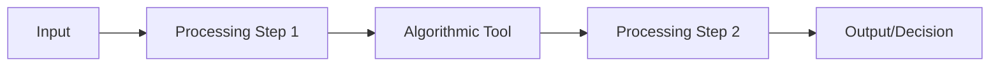

# AI Transparency Record (Australian AI Ethics Framework)

> **Template Status**: Alpha | **Version**: [VERSION] | **Command**: `/arckit.atrs`

## Document Control

| Field | Value |
|-------|-------|
| **Document ID** | ARC-[PROJECT_ID]-ATRS-v[VERSION] |
| **Document Type** | [DOCUMENT_TYPE_NAME] |
| **Project** | [PROJECT_NAME] (Project [PROJECT_ID]) |
| **Classification** | [PUBLIC / OFFICIAL / OFFICIAL: Sensitive / PROTECTED / SECRET] |
| **Status** | [DRAFT / IN_REVIEW / APPROVED / PUBLISHED / SUPERSEDED / ARCHIVED] |
| **Version** | [VERSION] |
| **Created Date** | [YYYY-MM-DD] |
| **Last Modified** | [YYYY-MM-DD] |
| **Review Cycle** | [Monthly / Quarterly / Annual / On-Demand] |
| **Next Review Date** | [YYYY-MM-DD] |
| **Owner** | [OWNER_NAME_AND_ROLE] |
| **Reviewed By** | [REVIEWER_NAME] on [DATE] or [PENDING] |
| **Approved By** | [APPROVER_NAME] on [DATE] or [PENDING] |
| **Distribution** | [DISTRIBUTION_LIST] |

## Revision History

| Version | Date | Author | Changes | Approved By | Approval Date |
|---------|------|--------|---------|-------------|---------------|
| [VERSION] | [DATE] | ArcKit AI | Initial creation from `/arckit.[COMMAND]` command | [PENDING] | [PENDING] |

## Document Purpose

[Brief description of what this document is for and how it will be used]

---

## About This Template

This template implements an **AI Transparency Record** aligned with the **Australian AI Ethics Framework**, published by the Department of Industry, Science and Resources. While there is no mandatory algorithmic transparency recording standard in Australia equivalent to the UK ATRS, this record is **strongly recommended** for:
- All Commonwealth government departments and agencies
- State and territory government bodies deploying AI systems
- Statutory authorities and government business enterprises delivering public services
- Any public sector organisation using algorithmic or AI tools that affect individuals

**Purpose**: The AI Transparency Record helps Australian public sector organisations provide clear, accountable information about how and why they use algorithmic tools, including AI systems, in alignment with Australia's voluntary AI Ethics Principles.

**Australian AI Ethics Framework - 8 Principles**:
1. **Human, societal and environmental wellbeing** - AI systems should benefit individuals, society and the environment
2. **Human-centred values** - AI systems should respect human rights, diversity, and the autonomy of individuals
3. **Fairness** - AI systems should be inclusive and accessible, and should not involve or result in unfair discrimination
4. **Privacy protection and security** - AI systems should respect and uphold privacy rights and data protection
5. **Reliability and safety** - AI systems should reliably operate in accordance with their intended purpose
6. **Transparency and explainability** - There should be transparency and responsible disclosure to ensure people know when they are being significantly impacted by AI and can find out when an AI system is engaging with them
7. **Contestability** - When an AI system significantly impacts a person, community, group or environment, there should be a timely process to allow people to challenge the use or outcomes of the AI system
8. **Accountability** - People responsible for the different phases of the AI system lifecycle should be identifiable and accountable for the outcomes of the AI systems

**Structure**:
- **Tier 1**: Summary information for the general public (clear, simple language)
- **Tier 2**: Detailed technical information for specialists, journalists, researchers

**Resources**:
- Australian AI Ethics Framework: https://www.industry.gov.au/publications/australias-artificial-intelligence-ethics-framework
- DTA Digital Service Standard: https://www.dta.gov.au/help-and-advice/about-digital-service-standard
- OAIC AI Guidance: https://www.oaic.gov.au/privacy/privacy-guidance-for-organisations-and-government-agencies
- Contact: [ai-transparency@department.gov.au]

---

# TIER 1: Summary Information
*For the general public - use clear, simple language*

## 1. Basic Information

### 1 - Name
**Tool Name**: [Name of the algorithmic tool]

### 2 - Description
**Brief Description** (1-2 sentences for public understanding):
[Describe what the tool does in plain English]

### 3 - Website URL
**More Information**: [URL to tool information page]

### 4 - Contact Email
**Contact**: [email@department.gov.au]

---

## 2. Organisation and Phase

### Organisation
- **Department/Organisation**: [e.g., Services Australia, Department of Health and Aged Care]
- **Organisation Type**: [ ] Commonwealth Department / [ ] Statutory Authority / [ ] Executive Agency / [ ] Government Business Enterprise / [ ] State/Territory Agency / [ ] Local Government / [ ] Other

### Function
[ ] Benefits and welfare (Centrelink, Services Australia)
[ ] Crime and policing
[ ] Education
[ ] Healthcare (Medicare, My Health Record)
[ ] Immigration and border protection
[ ] Justice
[ ] Licensing and regulation
[ ] Tax and revenue (ATO)
[ ] Transport
[ ] Defence
[ ] Environment
[ ] Other: _______________

### Geographic Region
[ ] Australian Capital Territory
[ ] New South Wales
[ ] Northern Territory
[ ] Queensland
[ ] South Australia
[ ] Tasmania
[ ] Victoria
[ ] Western Australia
[ ] Australia-wide (all states and territories)
[ ] Other: _______________

### Phase
[ ] Pre-deployment (planning/development)
[ ] Private Beta (limited testing)
[ ] Public Beta (wider testing)
[ ] Production (live use)
[ ] Retired (no longer in use)

**Start Date**: [YYYY-MM or YYYY-MM-DD]
**End Date** (if retired): [YYYY-MM or YYYY-MM-DD]

---

# TIER 2: Detailed Information
*For specialists, journalists, researchers - more technical detail*

---

## Section 1: Owner and Responsibility

### 1.1 - Organisation or Department
**Owning Organisation**: [Full official name]

### 1.2 - Team
**Responsible Team**: [Team name and role]

### 1.3 - Senior Responsible Owner
**SRO Name**: [Name]
**SRO Role**: [Job title]
**SRO Accountability**: [Description of accountability]

*AI Ethics Principle 8 (Accountability): Identify the individuals accountable for the outcomes of this AI system across its lifecycle.*

### 1.4 - External Supplier Involvement
**External Suppliers Used**: [ ] Yes / [ ] No

#### 1.4.1 - External Supplier(s)
1. **Supplier Name**: [Company name]
2. **Supplier Name**: [Company name]

#### 1.4.2 - ABN(s)
1. [Australian Business Number]
2. [Australian Business Number]

#### 1.4.3 - External Supplier Role
[Describe what each supplier provides - development, hosting, AI models, data processing, etc.]

#### 1.4.4 - Procurement Procedure Type
[ ] Open tender
[ ] Select tender
[ ] Limited tender (state justification): _______________
[ ] Pre-qualified tender
[ ] Panel arrangement: [Panel name, e.g., Digital Marketplace]
[ ] Coordinated procurement
[ ] Standing offer

#### 1.4.5 - Data Access Terms
[Describe supplier access to data, data processing agreements, data residency, security controls]

---

## Section 2: Description and Rationale

### 2.1 - Detailed Description
**Technical Architecture**:
[Describe the algorithmic tool's architecture, components, data flow]

**Algorithm Type**:
[ ] Rule-based (deterministic logic)
[ ] Machine Learning - Supervised
[ ] Machine Learning - Unsupervised
[ ] Machine Learning - Reinforcement Learning
[ ] Generative AI (LLM/Foundation Model)
[ ] Computer Vision
[ ] Natural Language Processing
[ ] Optimization/Operations Research
[ ] Statistical Model
[ ] Hybrid approach
[ ] Other: _______________

**AI Model Details** (if applicable):
- **Model Name/Type**: [e.g., GPT-4, BERT, custom model]
- **Model Provider**: [e.g., OpenAI, Anthropic, Google, in-house]
- **Model Version**: [Version number]
- **Fine-tuned**: [ ] Yes / [ ] No
- **Training Data**: [Description of training data used]

**Technical Components**:
- [List key technical components, APIs, databases, infrastructure]

### 2.2 - Scope
**Intended Use**:
[Describe the specific use cases and boundaries]

**Out of Scope**:
[Explicitly state what the tool is NOT designed to do]

**User Population**:
- **Internal Users**: [Number and roles of staff using the tool]
- **External Users**: [Number and types of citizens/public affected]

**Geographic Scope**: [Specific states/territories or Australia-wide]

### 2.3 - Benefit
**Intended Benefits**:
[Describe expected positive outcomes]

*AI Ethics Principle 1 (Human, societal and environmental wellbeing): Explain how this tool benefits individuals, society and the environment.*

**Impact Metrics**:
- [Metric 1: e.g., reduced processing time]
- [Metric 2: e.g., improved accuracy]
- [Metric 3: e.g., cost savings]

**Evidence of Benefits**:
[Cite evidence, trials, user research demonstrating benefits]

### 2.4 - Previous Process
**Before Implementation**:
[Describe how this task was done before the algorithmic tool]

**Comparison**:
| Aspect | Previous Process | Current Tool |
|--------|-----------------|--------------|
| Time | | |
| Accuracy | | |
| Cost | | |
| User Experience | | |
| Fairness | | |

### 2.5 - Alternatives Considered
**Alternative 1**: [Option considered]
- **Reason for Rejection**: [Why not chosen]

**Alternative 2**: [Option considered]
- **Reason for Rejection**: [Why not chosen]

**Non-Algorithmic Approach**:
[Why a non-AI/algorithmic solution was not suitable]

---

## Section 3: Decision-Making Process

### 3.1 - Process Integration
**Role in Workflow**:
[Describe where the tool fits in the overall process]

**Process Diagram**:

**Integration Points**:
- [System 1 integration]
- [System 2 integration]

### 3.2 - Provided Information
**Outputs**:
[Describe what information the tool provides]

**Output Format**:
[ ] Score/Rating
[ ] Classification/Category
[ ] Recommendation
[ ] Prediction
[ ] Ranking/Prioritization
[ ] Risk Assessment
[ ] Generated Content
[ ] Other: _______________

**Output Interpretation**:
[Explain how to interpret the tool's outputs]

### 3.3 - Frequency and Scale of Usage
**Usage Volume**:
- **Decisions per day/month/year**: [Number]
- **Users affected per day/month/year**: [Number]
- **Staff users**: [Number]

**Usage Pattern**:
[ ] Continuous/Real-time
[ ] Batch processing (daily/weekly/monthly)
[ ] On-demand

### 3.4 - Human Decisions and Review

*AI Ethics Principle 2 (Human-centred values): Describe how human oversight preserves individual autonomy and rights.*

**Human Oversight Model**:
[ ] Human-in-the-loop (review EVERY decision before action)
[ ] Human-on-the-loop (periodic/sample review)
[ ] Human-in-command (can override at any time)
[ ] Fully automated (explain justification): _______________

**Review Process**:
[Describe how human reviewers assess algorithmic outputs]

**Override Capability**:
- **Can humans override**: [ ] Yes / [ ] No
- **Override frequency**: [e.g., X% of cases]
- **Override reasons**: [Common reasons for overriding algorithm]

**Quality Assurance**:
[Describe QA processes, sample checks, audits]

### 3.5 - Required Training
**Staff Training Program**:
- **Duration**: [Hours/days of training]
- **Content**: [What training covers]
- **Certification**: [ ] Yes / [ ] No

**Training Topics**:
- [ ] How the algorithm works
- [ ] AI limitations and risks
- [ ] Bias and fairness awareness
- [ ] Override procedures
- [ ] Escalation process
- [ ] User rights (contestability)
- [ ] Australian AI Ethics Principles

**Ongoing Training**: [Frequency of refresher training]

### 3.6 - Appeals and Contestability

*AI Ethics Principle 7 (Contestability): When an AI system significantly impacts a person, community, group or environment, there should be a timely process to allow people to challenge the use or outcomes of the AI system.*

**Right to Contest**:
[ ] Yes - users can contest algorithmic decisions
[ ] No - not applicable (explain): _______________

**Contest Process**:
1. [Step 1: How users submit contest/challenge]
2. [Step 2: Review process]
3. [Step 3: Resolution]

**Response Time**: [e.g., 28 days]

**Human Review for Contested Decisions**:
[Describe human review process for appeals]

**Escalation Path**:
[Describe how unresolved challenges can be escalated, e.g., to the Commonwealth Ombudsman, Administrative Appeals Tribunal]

---

## Section 4: Data

### 4.1 - Data Sources
**Input Data**:
1. **Data Source 1**:
   - **Type**: [e.g., Personal information, Administrative data, Open data]
   - **Origin**: [Where data comes from]
   - **Fields Used**: [Specific data fields]

2. **Data Source 2**:
   - **Type**: [e.g., Personal information, Administrative data, Open data]
   - **Origin**: [Where data comes from]
   - **Fields Used**: [Specific data fields]

**Personal Information**: [ ] Yes / [ ] No

**Sensitive Information** (e.g., health, racial/ethnic origin, political opinions, religious beliefs, sexual orientation, criminal record, biometric/genetic data): [ ] Yes / [ ] No
- If yes, specify: _______________
- Legal basis under Privacy Act 1988: _______________

*AI Ethics Principle 4 (Privacy protection and security): Describe how the system respects privacy rights and data protection in accordance with Australian Privacy Principles (APPs).*

### 4.2 - Data Sharing
**Data Shared With**:
- [Organisation/Partner 1]: [Purpose]
- [Organisation/Partner 2]: [Purpose]

**Legal Basis for Sharing**:
[Cite specific legislation, information sharing agreements, or APP authorisations]

### 4.3 - Data Quality and Maintenance
**Data Quality Assurance**:
[Describe data validation, cleansing, quality checks]

**Data Freshness**:
- **Update Frequency**: [Real-time / Daily / Weekly / Monthly]
- **Historical Data**: [How far back data goes]

**Data Completeness**:
[Percentage complete, known gaps]

### 4.4 - Data Storage and Security
**Data Location**:
[ ] Australia (onshore)
[ ] Certified under Hosting Certification Framework (HCF)
[ ] Overseas (specify country): _______________

**Cloud Provider**: [e.g., AWS, Azure, GCP, on-premise]

**IRAP Assessment Status**: [ ] Assessed / [ ] In Progress / [ ] Not Required

**Security Measures**:
- [ ] Encryption at rest
- [ ] Encryption in transit
- [ ] Access controls (RBAC)
- [ ] Audit logging
- [ ] Regular penetration testing
- [ ] Essential Eight compliance
- [ ] Essential Eight Maturity Level: [1 / 2 / 3]
- [ ] ISO 27001 certified
- [ ] ISM (Information Security Manual) aligned

**Data Retention**:
[How long data is kept and why, in accordance with Archives Act 1983 and agency-specific retention schedules]

---

## Section 5: Impact Assessments

### 5.1 - Privacy Impact Assessment (PIA)

*AI Ethics Principle 4 (Privacy protection and security): AI systems should respect and uphold privacy rights and data protection.*

**PIA Completed**: [ ] Yes / [ ] No / [ ] In Progress

**PIA Date**: [YYYY-MM-DD]

**PIA Outcome**:
[ ] Approved - low risk
[ ] Approved with mitigations
[ ] Requires OAIC consultation

**Key Risks Identified**:
1. [Risk 1 and mitigation]
2. [Risk 2 and mitigation]
3. [Risk 3 and mitigation]

**PIA Review Date**: [YYYY-MM-DD]

### 5.2 - Fairness and Non-Discrimination Impact Assessment

*AI Ethics Principle 3 (Fairness): AI systems should be inclusive and accessible, and should not involve or result in unfair discrimination against individuals, communities or groups.*

**Fairness Assessment Completed**: [ ] Yes / [ ] No / [ ] In Progress

**Fairness Assessment Date**: [YYYY-MM-DD]

**Protected Attributes Assessed** (under Australian anti-discrimination law):
- [ ] Age
- [ ] Disability
- [ ] Race, colour, national or ethnic origin
- [ ] Sex
- [ ] Sexual orientation
- [ ] Gender identity, intersex status
- [ ] Marital or relationship status
- [ ] Pregnancy and breastfeeding
- [ ] Religion
- [ ] Political opinion
- [ ] Social origin
- [ ] Medical record
- [ ] Trade union membership
- [ ] Criminal record (in relevant jurisdictions)

**Relevant Legislation**:
- [ ] Racial Discrimination Act 1975
- [ ] Sex Discrimination Act 1984
- [ ] Disability Discrimination Act 1992
- [ ] Age Discrimination Act 2004
- [ ] Australian Human Rights Commission Act 1986
- [ ] State/territory anti-discrimination legislation

**Impact Assessment**:
| Protected Attribute | Potential Impact | Mitigation |
|---------------------|------------------|------------|
| Age | | |
| Disability | | |
| Race/Ethnicity | | |
| Sex | | |
| Other | | |

**Fairness Assessment Outcome**: [Summary and actions]

**Fairness Assessment Review Date**: [YYYY-MM-DD]

### 5.3 - Human Rights Assessment

*AI Ethics Principle 2 (Human-centred values): AI systems should respect human rights, diversity, and the autonomy of individuals.*

**Human Rights Assessment Completed**: [ ] Yes / [ ] No

**Human Rights Considered** (under Australian human rights framework):
- [ ] Right to equality and non-discrimination
- [ ] Right to privacy (Privacy Act 1988, APPs)
- [ ] Right to a fair hearing and natural justice (Administrative Decisions (Judicial Review) Act 1977)
- [ ] Freedom of expression
- [ ] Right to an effective remedy
- [ ] Rights under the Australian Human Rights Commission Act 1986
- [ ] Rights under state/territory human rights charters (e.g., Victorian Charter of Human Rights and Responsibilities Act 2006, ACT Human Rights Act 2004, Queensland Human Rights Act 2019)
- [ ] Other: _______________

**Human Rights Safeguards**:
[Describe how human rights are protected]

### 5.4 - Other Impact Assessments
**Environmental Impact Assessment**: [ ] Yes / [ ] No
- **Carbon Footprint**: [e.g., CO2e from model training/inference]
- **Sustainability Measures**: [Green hosting, energy efficiency]

*AI Ethics Principle 1 (Human, societal and environmental wellbeing): Consider the environmental impact of AI system operation.*

**Accessibility Assessment** (WCAG 2.2 Level AA): [ ] Yes / [ ] No

**Security Risk Assessment**: [ ] Yes / [ ] No

---

## Section 6: Fairness, Bias and Discrimination

*AI Ethics Principle 3 (Fairness): AI systems should be inclusive and accessible, and should not involve or result in unfair discrimination against individuals, communities or groups.*

### 6.1 - Bias Assessment
**Bias Testing Completed**: [ ] Yes / [ ] No / [ ] In Progress

**Bias Testing Date**: [YYYY-MM-DD]

**Testing Methodology**:
[Describe how bias was tested - datasets, metrics, methods]

### 6.2 - Fairness Metrics
**Fairness Metrics Calculated**:
- [ ] Demographic parity
- [ ] Equalized odds
- [ ] Equal opportunity
- [ ] Calibration
- [ ] Other: _______________

**Results**:
| Protected Attribute | Metric | Result | Threshold | Pass/Fail |
|---------------------|--------|--------|-----------|-----------|
| Gender | | | | |
| Ethnicity | | | | |
| Age | | | | |
| Disability | | | | |
| Indigenous status | | | | |

### 6.3 - Known Limitations and Bias
**Known Biases**:
1. [Bias 1]: [Description and cause]
2. [Bias 2]: [Description and cause]
3. [Bias 3]: [Description and cause]

**Mitigation Strategies**:
- [Strategy 1]
- [Strategy 2]
- [Strategy 3]

**Residual Risk**:
[Describe any remaining bias that couldn't be fully eliminated]

### 6.4 - Training Data Bias
**Training Data Review**: [ ] Yes / [ ] No

**Training Data Demographics**:
[Describe representation of different groups in training data, including representation of First Nations peoples, culturally and linguistically diverse communities, regional and remote populations]

**Known Data Gaps**:
[Groups underrepresented or missing from training data]

**Data Augmentation**:
[Methods used to address data gaps]

### 6.5 - Ongoing Bias Monitoring
**Monitoring Frequency**: [Daily / Weekly / Monthly / Quarterly / Annually]

**Monitoring Metrics**:
- [Metric 1]
- [Metric 2]

**Alert Thresholds**:
[When bias monitoring triggers a review]

---

## Section 7: Technical Details

### 7.1 - Model Performance

*AI Ethics Principle 5 (Reliability and safety): AI systems should reliably operate in accordance with their intended purpose.*

**Performance Metrics**:
| Metric | Value | Benchmark |
|--------|-------|-----------|
| Accuracy | | |
| Precision | | |
| Recall | | |
| F1 Score | | |
| False Positive Rate | | |
| False Negative Rate | | |

**Performance by Demographic Group**:
[Break down metrics by protected attributes]

### 7.2 - Model Explainability

*AI Ethics Principle 6 (Transparency and explainability): There should be transparency and responsible disclosure to ensure people know when they are being significantly impacted by AI and can find out when an AI system is engaging with them.*

**Explainability Approach**:
[ ] SHAP (SHapley Additive exPlanations)
[ ] LIME (Local Interpretable Model-agnostic Explanations)
[ ] Feature importance
[ ] Decision tree visualization
[ ] Natural language explanations
[ ] Other: _______________
[ ] Not applicable (rule-based system)

**Explanation Provided to Users**: [ ] Yes / [ ] No

**Example Explanation**:
[Provide example of how decision is explained to user]

### 7.3 - Model Versioning and Change Management
**Current Model Version**: [Version number]

**Version History**:
| Version | Date | Changes | Impact |
|---------|------|---------|--------|
| 1.0 | | Initial deployment | |
| 1.1 | | | |
| 2.0 | | | |

**Change Management Process**:
[Describe how model updates are tested, approved, deployed]

**Rollback Capability**: [ ] Yes / [ ] No

### 7.4 - Model Monitoring and Drift Detection
**Drift Monitoring**: [ ] Yes / [ ] No

**Monitoring Metrics**:
- **Data Drift**: [How input data distribution is monitored]
- **Concept Drift**: [How relationship between inputs and outputs is monitored]
- **Performance Drift**: [How accuracy changes over time]

**Alert Thresholds**:
[When drift triggers retraining or review]

**Retraining Schedule**:
[ ] Triggered by drift detection
[ ] Fixed schedule: [Frequency]
[ ] Ad-hoc based on performance review

---

## Section 8: Testing and Assurance

### 8.1 - Testing Approach
**Testing Phases**:
- [ ] Unit testing (individual components)
- [ ] Integration testing (system interaction)
- [ ] User acceptance testing (UAT)
- [ ] A/B testing
- [ ] Shadow testing (parallel running)
- [ ] Red teaming (adversarial testing)

**Test Coverage**: [Percentage or description]

### 8.2 - Edge Cases and Failure Modes

*AI Ethics Principle 5 (Reliability and safety): Describe how the system handles unexpected inputs and failure conditions safely.*

**Known Edge Cases**:
1. [Edge case 1 and handling]
2. [Edge case 2 and handling]
3. [Edge case 3 and handling]

**Failure Modes**:
| Failure Mode | Probability | Impact | Mitigation |
|--------------|-------------|--------|------------|
| Model returns no result | | | |
| Model fails to process input | | | |
| Performance degradation | | | |

**Fallback Procedures**:
[What happens when algorithm fails]

### 8.3 - Security Testing

*AI Ethics Principle 4 (Privacy protection and security): AI systems should respect and uphold privacy rights and data protection, and ensure the security of data.*

**Security Assessments Completed**:
- [ ] Penetration testing
- [ ] Vulnerability scanning
- [ ] AI-specific threat assessment:
  - [ ] Prompt injection testing (for LLMs)
  - [ ] Data poisoning risk assessment
  - [ ] Model inversion attack assessment
  - [ ] Adversarial example testing
  - [ ] Model theft/extraction risk
- [ ] IRAP assessment (if cloud-hosted)

**Security Findings**: [Summary and remediation]

### 8.4 - Independent Assurance
**Independent Review**: [ ] Yes / [ ] No

**Reviewer**: [Organisation/team]

**Review Date**: [YYYY-MM-DD]

**Review Outcome**: [Summary and recommendations]

**External Audit**: [ ] Yes / [ ] No / [ ] Planned

---

## Section 9: Transparency and Explainability

*AI Ethics Principle 6 (Transparency and explainability): There should be transparency and responsible disclosure to ensure people know when they are being significantly impacted by AI and can find out when an AI system is engaging with them.*

### 9.1 - Public Information
**Public Disclosure**:
- [ ] Tool is publicly disclosed
- [ ] AI Transparency Record published on department website
- [ ] Information available on agency website
- [ ] Model card published
- [ ] Open source code

**Website URL**: [URL to public information]

### 9.2 - User Communication
**Users Informed**: [ ] Yes / [ ] Partially / [ ] No

**How Users Are Informed**:
- [ ] Direct notification
- [ ] Website information
- [ ] Privacy notice / APP notification
- [ ] Terms of service
- [ ] In-application message

**Information Provided to Users**:
- [ ] That an algorithm/AI is being used
- [ ] What the algorithm does
- [ ] How it affects them
- [ ] How to contest decisions
- [ ] How their personal information is used
- [ ] Who is accountable for the system

### 9.3 - Model Card
**Model Card Published**: [ ] Yes / [ ] No

**Model Card URL**: [URL]

**Model Card Contents**:
- [ ] Model architecture
- [ ] Training data description
- [ ] Performance metrics
- [ ] Limitations
- [ ] Bias testing results
- [ ] Intended use
- [ ] Out-of-scope uses

---

## Section 10: Governance and Oversight

*AI Ethics Principle 8 (Accountability): People responsible for the different phases of the AI system lifecycle should be identifiable and accountable for the outcomes of the AI systems, and human oversight of AI systems should be enabled.*

### 10.1 - Governance Structure
**Governance Board**: [Name of board/committee]

**Board Composition**:
- [Role 1]
- [Role 2]
- [Role 3]

**Board Responsibilities**:
- [Responsibility 1]
- [Responsibility 2]

**Meeting Frequency**: [e.g., Monthly, Quarterly]

### 10.2 - Risk Management
**Risk Register Maintained**: [ ] Yes / [ ] No

**Top Risks**:
| Risk | Likelihood | Impact | Mitigation | Owner |
|------|------------|--------|------------|-------|
| | | | | |
| | | | | |
| | | | | |

**Risk Review Frequency**: [e.g., Monthly]

### 10.3 - Incident Management
**Incident Response Plan**: [ ] Yes / [ ] No

**Incident Types**:
- [ ] Algorithm error/failure
- [ ] Bias/discrimination incident
- [ ] Data breach (notifiable under the Notifiable Data Breaches scheme)
- [ ] Security incident
- [ ] Public complaint

**Incident Response Process**:
1. [Detection]
2. [Escalation]
3. [Response]
4. [Resolution]
5. [Review and lessons learned]

**Notifiable Data Breach Obligations**:
[Describe obligations under Part IIIC of the Privacy Act 1988 and notification procedures to the OAIC]

**Contact for Incidents**: [email@department.gov.au]

### 10.4 - Audit Trail
**Audit Logging**: [ ] Yes / [ ] No

**Logged Events**:
- [ ] All algorithmic decisions
- [ ] User access
- [ ] Configuration changes
- [ ] Model updates
- [ ] Data access

**Log Retention**: [Duration]

**Log Review**: [Frequency and process]

---

## Section 11: Compliance

### 11.1 - Legal Basis
**Primary Legislation**:
- [Act 1]: [Specific sections]
- [Act 2]: [Specific sections]

**Regulatory Compliance**:
- [ ] Privacy Act 1988 and Australian Privacy Principles (APPs)
- [ ] Freedom of Information Act 1982
- [ ] Disability Discrimination Act 1992
- [ ] Racial Discrimination Act 1975
- [ ] Sex Discrimination Act 1984
- [ ] Age Discrimination Act 2004
- [ ] Australian Human Rights Commission Act 1986
- [ ] Archives Act 1983
- [ ] Public Governance, Performance and Accountability Act 2013
- [ ] AI-specific regulation (if applicable)

### 11.2 - Data Protection
**Data Custodian**: [Organisation name]

**Privacy Officer / Privacy Contact Officer**: [Name and contact]

**Agency Privacy Policy URL**: [URL]

**Legal Basis for Collection and Use** (under APPs):
[ ] Consent (APP 3)
[ ] Reasonably necessary for agency functions or activities (APP 3)
[ ] Required or authorised by law (APP 6)
[ ] Enforcement related activity (APP 6)
[ ] Other permitted purpose: _______________

### 11.3 - Standards Compliance
**Standards Followed**:
- [ ] Australian AI Ethics Framework (Department of Industry, Science and Resources)
- [ ] DTA Digital Service Standard
- [ ] ASD Information Security Manual (ISM)
- [ ] Protective Security Policy Framework (PSPF)
- [ ] Hosting Certification Framework (HCF)
- [ ] ASD Essential Eight
- [ ] ISO 27001 (Information Security)
- [ ] ISO 9001 (Quality Management)
- [ ] AS/NZS ISO 31000 (Risk Management)
- [ ] Other: _______________

### 11.4 - Procurement Compliance
**Procurement Route**: [e.g., Digital Marketplace, AusTender, Open Tender, Panel Arrangement]

**Contract Value**: [AUD amount or range]

**Commonwealth Procurement Rules Compliance**: [ ] Yes / [ ] No / [ ] N/A

---

## Section 12: AI Ethics Principles Assessment

*This section provides a consolidated assessment against the 8 Australian AI Ethics Principles.*

### 12.1 - Principle 1: Human, Societal and Environmental Wellbeing
**Assessment**: [ ] Fully Addressed / [ ] Partially Addressed / [ ] Not Yet Addressed

**Evidence**:
[Describe how this AI system benefits individuals, society and the environment]

**Gaps and Actions**:
[Identify any gaps and planned remediation]

### 12.2 - Principle 2: Human-Centred Values
**Assessment**: [ ] Fully Addressed / [ ] Partially Addressed / [ ] Not Yet Addressed

**Evidence**:
[Describe how this AI system respects human rights, diversity, and individual autonomy]

**Gaps and Actions**:
[Identify any gaps and planned remediation]

### 12.3 - Principle 3: Fairness
**Assessment**: [ ] Fully Addressed / [ ] Partially Addressed / [ ] Not Yet Addressed

**Evidence**:
[Describe how this AI system is inclusive, accessible, and avoids unfair discrimination]

**Gaps and Actions**:
[Identify any gaps and planned remediation]

### 12.4 - Principle 4: Privacy Protection and Security
**Assessment**: [ ] Fully Addressed / [ ] Partially Addressed / [ ] Not Yet Addressed

**Evidence**:
[Describe how this AI system respects privacy rights and ensures data security]

**Gaps and Actions**:
[Identify any gaps and planned remediation]

### 12.5 - Principle 5: Reliability and Safety
**Assessment**: [ ] Fully Addressed / [ ] Partially Addressed / [ ] Not Yet Addressed

**Evidence**:
[Describe how this AI system reliably operates in accordance with its intended purpose]

**Gaps and Actions**:
[Identify any gaps and planned remediation]

### 12.6 - Principle 6: Transparency and Explainability
**Assessment**: [ ] Fully Addressed / [ ] Partially Addressed / [ ] Not Yet Addressed

**Evidence**:
[Describe how transparency and responsible disclosure are ensured]

**Gaps and Actions**:
[Identify any gaps and planned remediation]

### 12.7 - Principle 7: Contestability
**Assessment**: [ ] Fully Addressed / [ ] Partially Addressed / [ ] Not Yet Addressed

**Evidence**:
[Describe the timely process that allows people to challenge the use or outcomes of this AI system]

**Gaps and Actions**:
[Identify any gaps and planned remediation]

### 12.8 - Principle 8: Accountability
**Assessment**: [ ] Fully Addressed / [ ] Partially Addressed / [ ] Not Yet Addressed

**Evidence**:
[Describe how people responsible for this AI system are identifiable and accountable]

**Gaps and Actions**:
[Identify any gaps and planned remediation]

### 12.9 - Overall AI Ethics Compliance Summary
| Principle | Status | Key Evidence | Key Gaps |
|-----------|--------|-------------|----------|
| 1. Human, societal and environmental wellbeing | | | |
| 2. Human-centred values | | | |
| 3. Fairness | | | |
| 4. Privacy protection and security | | | |
| 5. Reliability and safety | | | |
| 6. Transparency and explainability | | | |
| 7. Contestability | | | |
| 8. Accountability | | | |

---

## Section 13: Performance and Outcomes

### 13.1 - Success Metrics
**KPIs**:
1. [KPI 1]: [Target] - [Current performance]
2. [KPI 2]: [Target] - [Current performance]
3. [KPI 3]: [Target] - [Current performance]

**Benefits Realised**:
- [Benefit 1]: [Evidence]
- [Benefit 2]: [Evidence]
- [Benefit 3]: [Evidence]

### 13.2 - User Feedback
**User Research Conducted**: [ ] Yes / [ ] No

**User Satisfaction**: [Score or qualitative feedback]

**User Concerns**:
- [Concern 1 and response]
- [Concern 2 and response]

**Feedback Mechanism**: [How users can provide feedback]

### 13.3 - Continuous Improvement
**Improvement Log**:
| Date | Issue | Action Taken | Outcome |
|------|-------|--------------|---------|
| | | | |
| | | | |

**Lessons Learned**:
- [Lesson 1]
- [Lesson 2]
- [Lesson 3]

---

## Section 14: Review and Updates

### 14.1 - Review Schedule
**AI Transparency Record Review Frequency**: [e.g., Annually, or when significant changes]

**Next Review Date**: [YYYY-MM-DD]

**Trigger for Unscheduled Review**:
- [ ] Significant model change
- [ ] Change in usage/scope
- [ ] Incident or complaint
- [ ] Regulatory change
- [ ] New evidence of bias
- [ ] Change to Australian AI Ethics Framework or related guidance

### 14.2 - Version History
| Version | Date | Author | Changes |
|---------|------|--------|---------|
| 1.0 | | | Initial AI Transparency Record |
| 1.1 | | | |
| 2.0 | | | |

### 14.3 - Contact for Updates
**AI Transparency Record Owner**: [Name]
**Email**: [email@department.gov.au]
**Last Updated**: [YYYY-MM-DD]

---

## Appendices

### Appendix A: Glossary
- **Algorithm**: [Definition for your context]
- **Machine Learning**: [Definition]
- **Training Data**: [Definition]
- **Bias**: [Definition]
- **PIA**: Privacy Impact Assessment
- **APP**: Australian Privacy Principle
- **OAIC**: Office of the Australian Information Commissioner
- **DTA**: Digital Transformation Agency
- **ISM**: Information Security Manual
- **IRAP**: Information Security Registered Assessors Program
- **HCF**: Hosting Certification Framework
- **PSPF**: Protective Security Policy Framework

### Appendix B: References
- Australian AI Ethics Framework: https://www.industry.gov.au/publications/australias-artificial-intelligence-ethics-framework
- Australian Privacy Principles: https://www.oaic.gov.au/privacy/australian-privacy-principles
- DTA Digital Service Standard: https://www.dta.gov.au/help-and-advice/about-digital-service-standard
- ASD Information Security Manual: https://www.cyber.gov.au/resources-business-and-government/essential-cyber-security/ism
- Protective Security Policy Framework: https://www.protectivesecurity.gov.au/
- Hosting Certification Framework: https://www.dta.gov.au/help-and-advice/hosting-certification-framework
- [Additional references]

### Appendix C: Supporting Documentation
- [ ] Full Privacy Impact Assessment (PIA)
- [ ] Full Fairness and Non-Discrimination Impact Assessment
- [ ] Human Rights Assessment
- [ ] Model Card
- [ ] User Research Reports
- [ ] Audit Reports
- [ ] Test Results
- [ ] IRAP Assessment Report

---

## Publication Checklist

Before publishing this AI Transparency Record:

**Completeness**:
- [ ] All Tier 1 fields completed
- [ ] All mandatory Tier 2 fields completed
- [ ] Plain English used in Tier 1
- [ ] Technical detail sufficient in Tier 2
- [ ] All 8 AI Ethics Principles assessed in Section 12

**Approvals**:
- [ ] Senior Responsible Owner approval
- [ ] Legal/compliance review
- [ ] Privacy Officer review
- [ ] Communications team review (public-facing content)

**Impact Assessments**:
- [ ] Privacy Impact Assessment (PIA) completed and approved
- [ ] Fairness and Non-Discrimination Impact Assessment completed
- [ ] Human Rights Assessment completed (if applicable)
- [ ] Security Risk Assessment completed

**Quality**:
- [ ] Accuracy verified
- [ ] Links work
- [ ] Contact details current
- [ ] Sensitive information redacted

**Publication**:
- [ ] Published on department/agency website
- [ ] Stakeholders informed
- [ ] Review date set
- [ ] DTA notified (if applicable)

---

**END OF AI TRANSPARENCY RECORD**

For guidance on the Australian AI Ethics Framework, see:
https://www.industry.gov.au/publications/australias-artificial-intelligence-ethics-framework

For questions about AI governance in the Australian Government, contact the Digital Transformation Agency (DTA) or the Department of Industry, Science and Resources.

## External References

| Document | Type | Source | Key Extractions | Path |
|----------|------|--------|-----------------|------|
| *None provided* | — | — | — | — |

---

**Generated by**: ArcKit `/arckit.atrs` command
**Generated on**: [DATE]
**ArcKit Version**: [VERSION]
**Project**: [PROJECT_NAME]
**Model**: [AI_MODEL]
