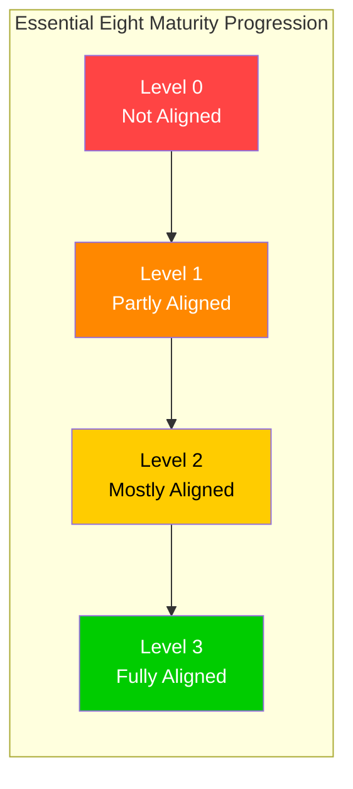

# Australian Government Secure by Design Assessment

> **Template Status**: Beta | **Version**: [VERSION] | **Command**: `/arckit.secure`

## Document Control

| Field | Value |
|-------|-------|
| **Document ID** | ARC-[PROJECT_ID]-SECD-v[VERSION] |
| **Document Type** | [DOCUMENT_TYPE_NAME] |
| **Project** | [PROJECT_NAME] (Project [PROJECT_ID]) |
| **Classification** | [PUBLIC / OFFICIAL / OFFICIAL: Sensitive / PROTECTED / SECRET] |
| **Status** | [DRAFT / IN_REVIEW / APPROVED / PUBLISHED / SUPERSEDED / ARCHIVED] |
| **Version** | [VERSION] |
| **Created Date** | [YYYY-MM-DD] |
| **Last Modified** | [YYYY-MM-DD] |
| **Review Cycle** | [Monthly / Quarterly / Annual / On-Demand] |
| **Next Review Date** | [YYYY-MM-DD] |
| **Owner** | [OWNER_NAME_AND_ROLE] |
| **Reviewed By** | [REVIEWER_NAME] on [DATE] or [PENDING] |
| **Approved By** | [APPROVER_NAME] on [DATE] or [PENDING] |
| **Distribution** | [DISTRIBUTION_LIST] |

## Revision History

| Version | Date | Author | Changes | Approved By | Approval Date |
|---------|------|--------|---------|-------------|---------------|
| [VERSION] | [DATE] | ArcKit AI | Initial creation from `/arckit.[COMMAND]` command | [PENDING] | [PENDING] |

## Document Purpose

[Brief description of what this document is for and how it will be used. This assessment evaluates the security posture of an Australian Government project against the ASD Essential Eight mitigation strategies, the Information Security Manual (ISM), and the Protective Security Policy Framework (PSPF).]

---

## Executive Summary

**Overall Security Posture**: [Strong / Adequate / Needs Improvement / Inadequate]

**Essential Eight Maturity Level**: [Level 0 (not aligned) / Level 1 (partly aligned) / Level 2 (mostly aligned) / Level 3 (fully aligned)]

**ISM Compliance Status**: [X key control groups assessed — see Section 2]

**Key Security Findings**:
- [Summary of critical security gaps]
- [Summary of security strengths]
- [Blocking security issues for next phase]

**PSPF Alignment**: [Aligned / Partially Aligned / Not Aligned]

**IRAP Assessment Status**: [Not Started / In Progress / Completed / N/A]

**Risk Summary**: [Overall security risk level: Low / Medium / High / Very High]

---

## 1. ASD Essential Eight Assessment

The ASD Essential Eight mitigation strategies are prioritised controls recommended by the Australian Cyber Security Centre (ACSC) to protect systems against cyber threats. Each control is assessed against the Essential Eight Maturity Model.

**Maturity Level Definitions**:
- **Level 0**: Not aligned with the intent of the mitigation strategy
- **Level 1**: Partly aligned with the intent of the mitigation strategy
- **Level 2**: Mostly aligned with the intent of the mitigation strategy
- **Level 3**: Fully aligned with the intent of the mitigation strategy

**Target Maturity Level**: [Level 1 / Level 2 / Level 3]

### E8-1: Application Control

**Current Maturity Level**: [Level 0 / Level 1 / Level 2 / Level 3]

**Evidence**:
[Describe application control implementation]

**Controls Assessment**:
- [ ] Application control is implemented on workstations
- [ ] Application control is implemented on internet-facing servers
- [ ] Application control is implemented on non-internet-facing servers
- [ ] Application control restricts execution to an approved set of executables, software libraries, scripts, installers, compiled HTML, HTML applications, and control panel applets
- [ ] Allowed and blocked execution events are logged
- [ ] Application control rulesets are validated annually or more frequently

**Gaps/Actions**:
- [Action 1]
- [Action 2]

### E8-2: Patch Applications

**Current Maturity Level**: [Level 0 / Level 1 / Level 2 / Level 3]

**Evidence**:
[Describe application patching practices]

**Controls Assessment**:
- [ ] An automated mechanism is used to discover assets with missing patches or updates for applications
- [ ] Patches, updates, or vendor mitigations for security vulnerabilities in internet-facing services are applied within two weeks of release
- [ ] Patches, updates, or vendor mitigations for security vulnerabilities in office productivity suites, web browsers, email clients, PDF software, and security products are applied within two weeks of release
- [ ] Patches, updates, or vendor mitigations for security vulnerabilities in other applications are applied within one month of release
- [ ] Applications that are no longer supported by vendors are removed

**Gaps/Actions**:
- [Action 1]
- [Action 2]

### E8-3: Configure Microsoft Office Macro Settings

**Current Maturity Level**: [Level 0 / Level 1 / Level 2 / Level 3]

**Evidence**:
[Describe Microsoft Office macro configuration]

**Controls Assessment**:
- [ ] Microsoft Office macros are disabled for users who do not have a demonstrated business requirement
- [ ] Microsoft Office macros in files originating from the internet are blocked
- [ ] Microsoft Office macro antivirus scanning is enabled
- [ ] Microsoft Office macro security settings cannot be changed by users
- [ ] Only macros running from within a sandboxed environment, a Trusted Location, or that are digitally signed by a trusted publisher are allowed to execute
- [ ] Only privileged users responsible for validating macros can write to and modify content within Trusted Locations

**Gaps/Actions**:
- [Action 1]
- [Action 2]

### E8-4: User Application Hardening

**Current Maturity Level**: [Level 0 / Level 1 / Level 2 / Level 3]

**Evidence**:
[Describe user application hardening measures]

**Controls Assessment**:
- [ ] Web browsers are configured to block or disable web advertisements
- [ ] Web browsers are configured to block Java from the internet
- [ ] Web browsers are configured to block web-based Java
- [ ] Internet Explorer 11 is disabled or removed
- [ ] Web browser security settings cannot be changed by users
- [ ] .NET Framework 3.5 (includes .NET 2.0 and 3.0) is disabled or removed
- [ ] Windows PowerShell 2.0 is disabled or removed
- [ ] PowerShell is configured to use Constrained Language Mode
- [ ] Blocked PowerShell script execution events are logged

**Gaps/Actions**:
- [Action 1]
- [Action 2]

### E8-5: Restrict Administrative Privileges

**Current Maturity Level**: [Level 0 / Level 1 / Level 2 / Level 3]

**Evidence**:
[Describe administrative privilege restrictions]

**Controls Assessment**:
- [ ] Requests for privileged access to systems, applications, and data repositories are validated when first requested
- [ ] Privileged access to systems, applications, and data repositories is limited to that required for personnel to undertake their duties
- [ ] Privileged accounts are not used for reading email and browsing the web
- [ ] Privileged access events are logged
- [ ] Privileged accounts are disabled after 45 days of inactivity
- [ ] Privileged accounts (excluding break glass accounts) cannot be used to log on to a system via the local logon, remote desktop, or SSH
- [ ] Just-in-time administration is used for administering systems and applications

**Gaps/Actions**:
- [Action 1]
- [Action 2]

### E8-6: Patch Operating Systems

**Current Maturity Level**: [Level 0 / Level 1 / Level 2 / Level 3]

**Evidence**:
[Describe operating system patching practices]

**Controls Assessment**:
- [ ] An automated mechanism is used to discover assets with missing patches or updates for operating systems
- [ ] Patches, updates, or vendor mitigations for security vulnerabilities in operating systems of internet-facing services are applied within two weeks of release
- [ ] Patches, updates, or vendor mitigations for security vulnerabilities in operating systems of workstations, servers, and network devices are applied within one month of release
- [ ] Operating systems that are no longer supported by vendors are replaced
- [ ] The latest release or the previous release of operating systems are used

**Gaps/Actions**:
- [Action 1]
- [Action 2]

### E8-7: Multi-Factor Authentication

**Current Maturity Level**: [Level 0 / Level 1 / Level 2 / Level 3]

**Evidence**:
[Describe multi-factor authentication implementation]

**Controls Assessment**:
- [ ] MFA is used to authenticate users to their organisation's online services that process, store, or communicate sensitive data
- [ ] MFA is used to authenticate users to third-party online services that process, store, or communicate sensitive data
- [ ] MFA is used to authenticate users to their organisation's online customer services that process, store, or communicate sensitive customer data
- [ ] MFA is used to authenticate privileged users of systems
- [ ] MFA is used to authenticate users accessing important data repositories
- [ ] MFA uses either something users have and something users know, or something users have that is unlocked by something users know or are
- [ ] MFA is phishing-resistant (e.g. hardware security keys, passkeys)
- [ ] Successful and unsuccessful MFA events are logged

**Authentication Method**: [myGov Identity / Azure AD / AWS IAM Identity Center / Other]

**Gaps/Actions**:
- [Action 1]
- [Action 2]

### E8-8: Regular Backups

**Current Maturity Level**: [Level 0 / Level 1 / Level 2 / Level 3]

**Evidence**:
[Describe backup strategy and implementation]

**Controls Assessment**:
- [ ] Backups of important information, software, and configuration settings are performed and retained in accordance with business continuity requirements
- [ ] Backups are synchronised to enable restoration to a common point in time
- [ ] Backups are retained for a minimum period in accordance with organisational requirements
- [ ] Backups of important information, software, and configuration settings are stored disconnected from the source, or in a non-rewritable and non-erasable manner
- [ ] Restoration of backups to a common point in time is tested as part of disaster recovery exercises
- [ ] Unprivileged accounts cannot access backups belonging to other accounts
- [ ] Privileged accounts (excluding backup administrator accounts) cannot access backups belonging to other accounts

**Backup Frequency**: [Continuous / Hourly / Daily / Weekly]
**Backup Retention**: [X days/months/years]
**Last Successful Backup**: [Date/time]
**Last Restoration Test**: [Date]

**Gaps/Actions**:
- [Action 1]
- [Action 2]

### Essential Eight Maturity Summary

| Essential Eight Control | Target Level | Current Level | Gap | Priority |
|------------------------|-------------|---------------|-----|----------|
| 1. Application control | [Level X] | [Level X] | [Description] | [Critical/High/Medium/Low] |
| 2. Patch applications | [Level X] | [Level X] | [Description] | [Critical/High/Medium/Low] |
| 3. Configure Microsoft Office macro settings | [Level X] | [Level X] | [Description] | [Critical/High/Medium/Low] |
| 4. User application hardening | [Level X] | [Level X] | [Description] | [Critical/High/Medium/Low] |
| 5. Restrict administrative privileges | [Level X] | [Level X] | [Description] | [Critical/High/Medium/Low] |
| 6. Patch operating systems | [Level X] | [Level X] | [Description] | [Critical/High/Medium/Low] |
| 7. Multi-factor authentication | [Level X] | [Level X] | [Description] | [Critical/High/Medium/Low] |
| 8. Regular backups | [Level X] | [Level X] | [Description] | [Critical/High/Medium/Low] |
| **Overall Essential Eight Maturity** | **[Level X]** | **[Level X]** | | |

---

## 2. ISM (Information Security Manual) Controls Assessment

The ISM is produced by the Australian Signals Directorate (ASD) and provides a cyber security framework for Australian Government entities. The following assessment covers key ISM control groups.

### ISM-1: Cyber Security Roles and Responsibilities

**Status**: [Compliant | Partially Compliant | Non-Compliant | N/A]

**Evidence**:
[Describe cyber security governance structure and role assignments]

**Controls Assessment**:
- [ ] A Chief Information Security Officer (CISO) has been appointed
- [ ] Cyber security roles and responsibilities are defined and documented
- [ ] System owners have been identified for all systems
- [ ] System owners have approved system security plans
- [ ] A cyber security awareness program is in place
- [ ] Cyber security personnel have appropriate qualifications and experience
- [ ] Security clearances are held by personnel with access to classified information

**Gaps/Actions**:
- [Action 1]
- [Action 2]

### ISM-2: Cyber Security Incidents

**Status**: [Compliant | Partially Compliant | Non-Compliant | N/A]

**Evidence**:
[Describe incident management capabilities]

**Controls Assessment**:
- [ ] A cyber security incident response plan has been developed
- [ ] A cyber security incident register is maintained
- [ ] Cyber security incidents are reported to the ACSC
- [ ] Cyber security incidents are reported to the OAIC where a data breach involves personal information (Notifiable Data Breaches scheme)
- [ ] Incident response personnel are trained and the plan is exercised regularly
- [ ] Post-incident reviews are conducted and lessons learned are actioned
- [ ] Containment, eradication, and recovery procedures are documented

**IR Plan Last Tested**: [Date / Not Tested]

**Gaps/Actions**:
- [Action 1]
- [Action 2]

### ISM-3: System Hardening

**Status**: [Compliant | Partially Compliant | Non-Compliant | N/A]

**Evidence**:
[Describe system hardening approach]

**Controls Assessment**:
- [ ] Operating system hardening is applied using ASD/ACSC hardening guides
- [ ] Standard Operating Environments (SOEs) are developed, maintained, and used
- [ ] Unneeded operating system accounts, software, components, services, and functionality are removed or disabled
- [ ] Default credentials are changed or disabled
- [ ] Local administrator accounts are disabled or use unique passphrases
- [ ] Application hardening follows ACSC guidance
- [ ] Endpoint Detection and Response (EDR) is deployed
- [ ] Host-based Intrusion Detection/Prevention Systems are deployed where appropriate

**Operating Systems**: [Windows / Linux / macOS / Mixed]

**Gaps/Actions**:
- [Action 1]
- [Action 2]

### ISM-4: Communications Security

**Status**: [Compliant | Partially Compliant | Non-Compliant | N/A]

**Evidence**:
[Describe communications security measures]

**Controls Assessment**:
- [ ] ACSC-approved encryption is used for classified communications
- [ ] TLS 1.2 or above is used for data in transit
- [ ] Perfect Forward Secrecy (PFS) is enabled where applicable
- [ ] Email gateway controls are in place (SPF, DKIM, DMARC)
- [ ] Web content filtering is implemented
- [ ] DNS filtering is implemented
- [ ] Telephony and video conferencing security measures are in place

**Gaps/Actions**:
- [Action 1]
- [Action 2]

### ISM-5: Cryptography

**Status**: [Compliant | Partially Compliant | Non-Compliant | N/A]

**Evidence**:
[Describe cryptographic controls]

**Controls Assessment**:
- [ ] ASD Approved Cryptographic Algorithms (AACA) are used where required
- [ ] Encryption at rest uses AES-256 or equivalent
- [ ] Encryption in transit uses TLS 1.2+ with approved cipher suites
- [ ] Cryptographic key management procedures are documented
- [ ] Key lifecycle management (generation, distribution, storage, rotation, destruction) is implemented
- [ ] Hardware Security Modules (HSMs) are used for high-value key storage where appropriate
- [ ] Certificate management processes are in place

**Gaps/Actions**:
- [Action 1]
- [Action 2]

### ISM-6: Gateway Security

**Status**: [Compliant | Partially Compliant | Non-Compliant | N/A]

**Evidence**:
[Describe gateway security architecture]

**Controls Assessment**:
- [ ] Gateways are implemented between security domains
- [ ] Cross Domain Solutions (CDS) are used where data crosses security domains
- [ ] Content filtering is performed at gateways
- [ ] Data flow controls are implemented and documented
- [ ] Gateway event logging and monitoring is in place
- [ ] Web application firewalls (WAF) are deployed for internet-facing applications
- [ ] DDoS protection is implemented

**Gaps/Actions**:
- [Action 1]
- [Action 2]

### ISM-7: Network Security

**Status**: [Compliant | Partially Compliant | Non-Compliant | N/A]

**Evidence**:
[Describe network security architecture]

**Controls Assessment**:
- [ ] Network segmentation is implemented by function and sensitivity
- [ ] Network security zones are defined and enforced
- [ ] Firewalls are deployed at network boundaries
- [ ] Intrusion Detection/Prevention Systems (IDS/IPS) are deployed
- [ ] Network Access Control (NAC) is implemented
- [ ] Wireless network security controls (WPA3) are in place
- [ ] Remote access is secured (VPN with MFA)
- [ ] Network traffic is monitored and logged

**Network Architecture**: [On-premise / Cloud / Hybrid]

**Gaps/Actions**:
- [Action 1]
- [Action 2]

### ISM Controls Summary

| ISM Control Group | Status | Gaps Identified | Priority |
|-------------------|--------|-----------------|----------|
| 1. Cyber security roles and responsibilities | [Compliant/Partial/Non-Compliant] | [Description] | [Critical/High/Medium/Low] |
| 2. Cyber security incidents | [Compliant/Partial/Non-Compliant] | [Description] | [Critical/High/Medium/Low] |
| 3. System hardening | [Compliant/Partial/Non-Compliant] | [Description] | [Critical/High/Medium/Low] |
| 4. Communications security | [Compliant/Partial/Non-Compliant] | [Description] | [Critical/High/Medium/Low] |
| 5. Cryptography | [Compliant/Partial/Non-Compliant] | [Description] | [Critical/High/Medium/Low] |
| 6. Gateway security | [Compliant/Partial/Non-Compliant] | [Description] | [Critical/High/Medium/Low] |
| 7. Network security | [Compliant/Partial/Non-Compliant] | [Description] | [Critical/High/Medium/Low] |

---

## 3. PSPF (Protective Security Policy Framework) Alignment

The PSPF sets out government protective security policy and supports the protection of government people, information, and assets.

### 3.1 Information Security Classification

**Classification Applied**: [UNOFFICIAL / OFFICIAL / OFFICIAL: Sensitive / PROTECTED / SECRET / TOP SECRET]

**PSPF Information Security Controls**:
- [ ] Information is classified in accordance with the PSPF
- [ ] Security classification markings are applied correctly
- [ ] Information handling procedures match the classification level
- [ ] Personnel security clearances are appropriate for the classification level
- [ ] Physical security controls are appropriate for the classification level
- [ ] ICT security controls are appropriate for the classification level (per ISM)

**Gaps/Actions**:
- [Action 1]
- [Action 2]

### 3.2 Personnel Security

**Personnel Security Controls**:
- [ ] Personnel vetting is conducted in accordance with the PSPF
- [ ] Ongoing personnel suitability assessments are performed
- [ ] Separation of duties is implemented for sensitive functions
- [ ] Security awareness training is mandatory for all personnel
- [ ] Security briefings are conducted for personnel with access to classified information
- [ ] Termination procedures include revocation of all access

**Gaps/Actions**:
- [Action 1]
- [Action 2]

---

## 4. Privacy Act 1988 and Australian Privacy Principles (APPs)

### 4.1 Data Protection Compliance

**Privacy Officer Appointed**: [Yes / No / Not Required]

**OAIC Registration**: [Required / Not Required / Completed]

**Australian Privacy Principles Compliance**:
- [ ] APP 1: Open and transparent management of personal information
- [ ] APP 2: Anonymity and pseudonymity options provided
- [ ] APP 3: Collection of solicited personal information is lawful and necessary
- [ ] APP 4: Dealing with unsolicited personal information
- [ ] APP 5: Notification of the collection of personal information
- [ ] APP 6: Use or disclosure of personal information is limited to primary purpose
- [ ] APP 7: Direct marketing restrictions observed
- [ ] APP 8: Cross-border disclosure of personal information controls in place
- [ ] APP 9: Adoption, use, or disclosure of government related identifiers is controlled
- [ ] APP 10: Quality of personal information is maintained
- [ ] APP 11: Security of personal information is ensured
- [ ] APP 12: Access to personal information is provided on request
- [ ] APP 13: Correction of personal information is enabled

**Notifiable Data Breaches (NDB) Scheme**:
- [ ] Data breach response plan is documented
- [ ] Eligible data breaches are assessed and reported to the OAIC within required timeframes
- [ ] Affected individuals are notified as required

**Personal Data Processed**: [Yes / No]

**Sensitive Information Processed**: [Yes / No]

**Gaps/Actions**:
- [Action 1]
- [Action 2]

### 4.2 Privacy Impact Assessment (PIA)

**PIA Required**: [Yes / No]

**PIA Status**: [Completed / In Progress / Not Started / N/A]

**PIA Findings**:
- High risks identified: [Number]
- Mitigations implemented: [Number]
- Residual risks accepted: [Yes/No by whom]

**OAIC Consultation Required**: [Yes / No]

**Gaps/Actions**:
- [Action 1]
- [Action 2]

---

## 5. Secure Development Practices

### 5.1 Secure Software Development Lifecycle (SDLC)

**Development Methodology**: [Agile / Waterfall / DevOps]

**Secure Development Practices**:
- [ ] Secure coding standards defined (aligned with ISM software development guidelines)
- [ ] Security requirements in user stories
- [ ] Threat modeling in design phase
- [ ] Code review includes security
- [ ] Static Application Security Testing (SAST)
- [ ] Dynamic Application Security Testing (DAST)
- [ ] Software Composition Analysis (SCA)
- [ ] Dependency vulnerability scanning

**OWASP Top 10 Mitigation**:
- [ ] Injection flaws prevented
- [ ] Broken authentication prevented
- [ ] Sensitive data exposure prevented
- [ ] XML External Entities (XXE) prevented
- [ ] Broken access control prevented
- [ ] Security misconfiguration prevented
- [ ] Cross-Site Scripting (XSS) prevented
- [ ] Insecure deserialization prevented
- [ ] Using components with known vulnerabilities prevented
- [ ] Insufficient logging and monitoring addressed

**Gaps/Actions**:
- [Action 1]
- [Action 2]

### 5.2 DevSecOps

**CI/CD Security Integration**:
- [ ] Automated security testing in pipeline
- [ ] Secrets scanning (no hardcoded credentials)
- [ ] Container image scanning
- [ ] Infrastructure as Code (IaC) security scanning
- [ ] Build artifact signing
- [ ] Automated deployment security checks

**Gaps/Actions**:
- [Action 1]
- [Action 2]

---

## 6. Cloud Security (if applicable)

### 6.1 Cloud Service Provider

**Cloud Provider**: [AWS / Azure / GCP / ASD-certified provider / Other / N/A]

**Cloud Deployment Model**: [Public / Private / Community / Hybrid / N/A]

**Data Sovereignty**: [Australia only / APAC / Other]

**IRAP Assessment**:
- [ ] Cloud service provider has a current IRAP assessment
- [ ] IRAP assessment covers the classification level of data being processed
- [ ] IRAP assessment report has been reviewed
- [ ] Residual risks from IRAP assessment have been accepted by the authorising officer

**IRAP Assessment Status**: [Current / Expired / Not Assessed / N/A]
**IRAP Assessed Classification**: [OFFICIAL / OFFICIAL: Sensitive / PROTECTED]
**Hosting Certification Framework (HCF) Tier**: [Certified Strategic / Certified Assured / Uncertified]

**Cloud Security Controls**:
- [ ] Cloud Security Posture Management (CSPM) implemented
- [ ] Identity and Access Management (IAM) configured per ISM
- [ ] Encryption key management (customer-managed keys where appropriate)
- [ ] Network security groups and segmentation
- [ ] Cloud Access Security Broker (CASB) deployed
- [ ] Cloud security monitoring and logging
- [ ] Multi-region redundancy (within Australia where required)

**ASD Cloud Security Guidance Compliance**: [Compliant / Partially Compliant / Non-Compliant]

**Gaps/Actions**:
- [Action 1]
- [Action 2]

---

## 7. Vulnerability and Patch Management

### 7.1 Vulnerability Management

**Vulnerability Scanning Frequency**: [Daily / Weekly / Monthly]

**Scanning Coverage**: [X% of assets]

**Vulnerability Management Process**:
- [ ] Automated vulnerability scanning
- [ ] Vulnerability prioritisation (CVSS scores)
- [ ] Remediation SLAs defined (aligned with Essential Eight patching timelines)
- [ ] Exception process for unfixable vulnerabilities
- [ ] Vulnerability remediation tracking
- [ ] Metrics and reporting

**Remediation SLAs** (aligned with Essential Eight Maturity Model):
- Critical vulnerabilities (internet-facing): [Within 48 hours / 2 weeks / 1 month]
- Critical vulnerabilities (other): [Within 2 weeks / 1 month]
- High vulnerabilities: [Within X days]
- Medium vulnerabilities: [Within X days]
- Low vulnerabilities: [Within X days]

**Current Vulnerability Status**:
- Critical: [Number]
- High: [Number]
- Medium: [Number]
- Low: [Number]

**Gaps/Actions**:
- [Action 1]
- [Action 2]

### 7.2 Patch Management

**Patch Management Process** (aligned with Essential Eight controls E8-2 and E8-6):
- [ ] Patch assessment and testing
- [ ] Patch deployment schedule meets Essential Eight timelines
- [ ] Emergency patching process for critical vulnerabilities
- [ ] Patch compliance monitoring
- [ ] Rollback procedures documented

**Patch Compliance**: [X% of systems patched within SLA]

**Critical Patch SLA**: [Within 48 hours for internet-facing / 2 weeks for other]

**Gaps/Actions**:
- [Action 1]
- [Action 2]

---

## 8. Third-Party and Supply Chain Risk

### 8.1 Third-Party Risk Management

**Third-Party Security Assessment**:
- [ ] Vendor security questionnaires completed
- [ ] Vendor security certifications verified (ISO 27001, SOC 2, IRAP)
- [ ] Contractual security obligations defined
- [ ] Third-party access controls implemented
- [ ] Vendor risk register maintained
- [ ] Ongoing vendor monitoring conducted
- [ ] DTA Digital Marketplace panel membership verified (where applicable)

**Key Third Parties**:

| Vendor | Service | IRAP Status | Security Certifications | Risk Level | Mitigations |
|--------|---------|-------------|------------------------|------------|-------------|
| [Vendor 1] | [Service] | [Assessed/Not Assessed] | [ISO 27001/SOC 2/Other] | [H/M/L] | [Controls] |
| [Vendor 2] | [Service] | [Assessed/Not Assessed] | [ISO 27001/SOC 2/Other] | [H/M/L] | [Controls] |

**Gaps/Actions**:
- [Action 1]
- [Action 2]

### 8.2 Open Source Security

**Open Source Components**: [Number]

**OSS Security Controls**:
- [ ] Software Bill of Materials (SBOM) maintained
- [ ] Automated dependency scanning
- [ ] Known vulnerability detection (CVE)
- [ ] License compliance checks
- [ ] OSS component lifecycle management

**Gaps/Actions**:
- [Action 1]
- [Action 2]

---

## Overall Security Assessment Summary

### Essential Eight Maturity Scorecard

| Essential Eight Control | Target Level | Current Level | Status |
|------------------------|-------------|---------------|--------|
| 1. Application control | [Level X] | [Level X] | [Achieved/Gap] |
| 2. Patch applications | [Level X] | [Level X] | [Achieved/Gap] |
| 3. Configure Microsoft Office macro settings | [Level X] | [Level X] | [Achieved/Gap] |
| 4. User application hardening | [Level X] | [Level X] | [Achieved/Gap] |
| 5. Restrict administrative privileges | [Level X] | [Level X] | [Achieved/Gap] |
| 6. Patch operating systems | [Level X] | [Level X] | [Achieved/Gap] |
| 7. Multi-factor authentication | [Level X] | [Level X] | [Achieved/Gap] |
| 8. Regular backups | [Level X] | [Level X] | [Achieved/Gap] |
| **Overall Essential Eight Maturity** | **[Level X]** | **[Level X]** | **[Overall status]** |

### ISM Controls Scorecard

| ISM Control Group | Status | Key Findings |
|-------------------|--------|--------------|
| Cyber security roles and responsibilities | [Compliant/Partial/Non-Compliant] | [Summary] |
| Cyber security incidents | [Compliant/Partial/Non-Compliant] | [Summary] |
| System hardening | [Compliant/Partial/Non-Compliant] | [Summary] |
| Communications security | [Compliant/Partial/Non-Compliant] | [Summary] |
| Cryptography | [Compliant/Partial/Non-Compliant] | [Summary] |
| Gateway security | [Compliant/Partial/Non-Compliant] | [Summary] |
| Network security | [Compliant/Partial/Non-Compliant] | [Summary] |

### Security Posture Summary

**Strengths**:
- [Strength 1]
- [Strength 2]

**Critical Gaps**:
- [Gap 1 - blocks progression to next phase]
- [Gap 2 - unacceptable risk level]

**Overall Risk Rating**: [Low / Medium / High / Very High]

### Critical Security Issues

1. [Issue 1 with Essential Eight / ISM reference] - **CRITICAL** - [Impact]
2. [Issue 2 with Essential Eight / ISM reference] - **HIGH** - [Impact]
3. [Issue 3 with Essential Eight / ISM reference] - **HIGH** - [Impact]

### Recommendations

**Critical Priority** (0-30 days - must resolve before next phase):
- [Recommendation 1 - Owner - Due date]
- [Recommendation 2 - Owner - Due date]

**High Priority** (1-3 months - significant risk reduction):
- [Recommendation 1 - Owner - Due date]
- [Recommendation 2 - Owner - Due date]

**Medium Priority** (3-6 months - continuous improvement):
- [Recommendation 1 - Owner - Due date]
- [Recommendation 2 - Owner - Due date]

---

## Security Architecture Overview

```mermaid
graph TB
    subgraph "Australian Government Security Framework"
        PSPF["PSPF<br/>Protective Security Policy Framework"]
        ISM["ISM<br/>Information Security Manual"]
        E8["Essential Eight<br/>Mitigation Strategies"]
        IRAP["IRAP<br/>Cloud Assessment"]
        APPs["APPs<br/>Australian Privacy Principles"]
    end

    subgraph "Assessment Areas"
        GOV["Governance &<br/>Roles"]
        TECH["Technical<br/>Controls"]
        OPS["Operational<br/>Security"]
        SUPPLY["Supply Chain<br/>& Third Party"]
        CLOUD["Cloud<br/>Security"]
    end

    PSPF --> GOV
    ISM --> TECH
    ISM --> OPS
    E8 --> TECH
    IRAP --> CLOUD
    APPs --> OPS

    subgraph "Essential Eight Controls"
        E8_1["Application Control"]
        E8_2["Patch Applications"]
        E8_3["Office Macro Settings"]
        E8_4["User App Hardening"]
        E8_5["Restrict Admin Privileges"]
        E8_6["Patch Operating Systems"]
        E8_7["Multi-Factor Authentication"]
        E8_8["Regular Backups"]
    end

    E8 --> E8_1
    E8 --> E8_2
    E8 --> E8_3
    E8 --> E8_4
    E8 --> E8_5
    E8 --> E8_6
    E8 --> E8_7
    E8 --> E8_8
```

---

## Next Steps and Action Plan

**Immediate Actions** (0-30 days):
- [ ] [Action 1 - Owner - Due date]
- [ ] [Action 2 - Owner - Due date]

**Short-term Actions** (1-3 months):
- [ ] [Action 1 - Owner - Due date]
- [ ] [Action 2 - Owner - Due date]

**Long-term Actions** (3-12 months):
- [ ] [Action 1 - Owner - Due date]
- [ ] [Action 2 - Owner - Due date]

**Next Security Review**: [Date - recommend quarterly during development, annually in Live]

---

## Approval and Sign-Off

| Role | Name | Date | Signature |
|------|------|------|-----------|
| Project Lead | [Name] | | |
| Security Architect | [Name] | | |
| Chief Information Security Officer (CISO) | [Name] | | |
| Privacy Officer | [Name] | | |
| IRAP Assessor (if applicable) | [Name] | | |

---

**Document Control**:
- **Version**: 1.0
- **Classification**: [OFFICIAL / OFFICIAL: Sensitive / PROTECTED]
- **Last Reviewed**: [Date]
- **Next Review**: [Date - recommend quarterly]
- **Document Owner**: [Name/Role]

## Applicable Frameworks and Standards

| Framework | Authority | Relevance |
|-----------|-----------|-----------|
| ASD Essential Eight | Australian Signals Directorate (ASD) | Primary mitigation strategies for cyber threats |
| Information Security Manual (ISM) | Australian Signals Directorate (ASD) | Comprehensive cyber security controls framework |
| Protective Security Policy Framework (PSPF) | Attorney-General's Department | Whole-of-government protective security policy |
| IRAP (Information Security Registered Assessors Program) | ASD | Cloud service security assessment |
| Hosting Certification Framework (HCF) | DTA | Cloud hosting classification and certification |
| Privacy Act 1988 / Australian Privacy Principles | OAIC | Privacy and personal information protection |
| Notifiable Data Breaches (NDB) Scheme | OAIC | Mandatory data breach reporting |
| Digital Service Standard | Digital Transformation Agency (DTA) | 13 criteria for government digital services |
| Secure Cloud Strategy | ASD | Cloud security consumption guidance |
| Australian Government Architecture (AGA) | DTA | Reference architecture framework |

## External References

| Document | Type | Source | Key Extractions | Path |
|----------|------|--------|-----------------|------|
| *None provided* | — | — | — | — |

---

**Generated by**: ArcKit `/arckit.secure` command
**Generated on**: [DATE]
**ArcKit Version**: [VERSION]
**Project**: [PROJECT_NAME]
**Model**: [AI_MODEL]